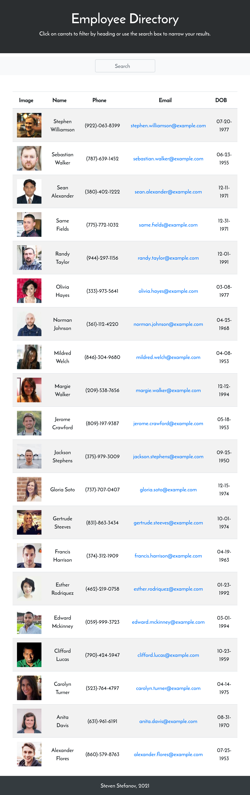
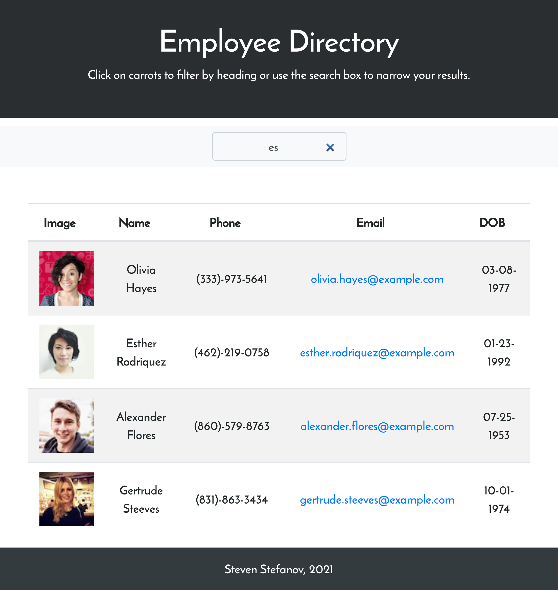

# React Employee Directory

## Description

The employee directory is a single-page web application built with React. It uses data fetched from the Random Users API. A deployed version of this can be found [here](https://stevenstefanov.github.io/employee-directory/).

## Installation

To be able to run this application locally:

1. Make sure to install [node.js](https://nodejs.dev/) on your local machine.
2. Clone or download the employee directory repository. Navigate to the root directory of the copy in your CLI and run the following command to install all required dependencies:
```
    npm install
```
3. Lastly, run the following to start a development server on localhost:
```
    npm start
```

## Usage

* When the page loads, 20 users will be loaded in randomly from the Random Users API.
* Start typing any name in the input field to filter the currently displayed users.
* You can sort users alphabetically by name, either by ascending or descending order.
* Emails are generated as a mailto: link which will open your local machines' default email application.

## Demo





